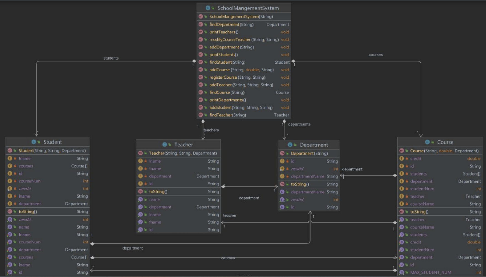

#  SchoolManagementSystem
A school management system that contains departments, students, teachers, and courses within a school, 
with each being interlinked together.

The final project for Introduction to Programming course (420-201-RE)
Done by using Object-Oriented-Programming (OOP) and the knowledge points covered throughout the course.

